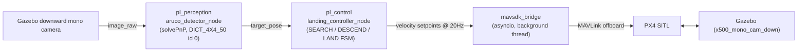
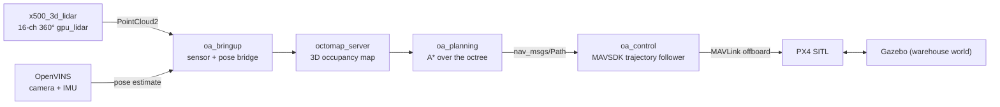
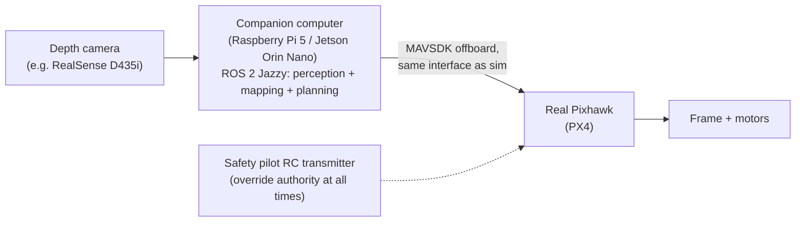

# AviationSim

A simulation-first autonomous-drone stack built on **PX4 SITL + Gazebo Harmonic +
ROS 2 Jazzy + MAVSDK**, developed as a series of milestones. Everything here runs
in simulation; a possible (not-yet-attempted) real-hardware follow-up is sketched
at the bottom.

## Environment

- Ubuntu 24.04, ROS 2 Jazzy
- PX4-Autopilot v1.16.0, cloned as a sibling directory: `~/PX4-Autopilot`
  (kept outside this repo / gitignored — see [`sim_assets/`](#repo-layout) for
  why that matters)
- Gazebo Harmonic (`gz-sim8`)
- MAVSDK (Python, `mavsdk` pip package)
- OpenCV with `cv2.aruco` support (Milestone 1 only)

## Repo layout

```
AviationSim/
├── precision_landing_ws/        ROS 2 workspace (src/ has the buildable packages)
│   └── src/
│       ├── pl_perception/       Milestone 1: ArUco marker detection
│       ├── pl_control/          Milestone 1: MAVSDK offboard bridge + landing FSM
│       ├── pl_bringup/          Milestone 1: launch files + params
│       └── (oa_bringup, oa_planning, oa_control land here as Milestone 2 progresses)
├── sim_assets/                  Gazebo worlds/models/airframes for Milestone 2,
│                                 version-controlled here and symlinked into the
│                                 PX4-Autopilot clone by scripts/link_gz_assets.sh
├── scripts/
│   ├── launch_sim.sh            One-command PX4 + Gazebo + ROS 2 launch (Milestone 1)
│   ├── link_gz_assets.sh        Symlinks sim_assets/ into ~/PX4-Autopilot
│   └── hover_test.py            Standalone MAVSDK hover smoke test
└── README.md
```

**Why `sim_assets/` exists:** PX4-Autopilot is gitignored from this repo, but
custom Gazebo worlds/models/airframe scripts have to physically live inside
the PX4 clone's directory tree to be usable. `sim_assets/` is the source of
truth (tracked here in git); `scripts/link_gz_assets.sh` symlinks each piece
into place and — for airframes — patches the one PX4 `CMakeLists.txt` line
that registers a new `gz_<model>` make target. Re-run it any time you re-clone
PX4-Autopilot.

## Milestone 1 — GPS-denied precision landing

**Goal:** land on a 0.5 m ArUco marker using only vision + baro altitude for
the final approach — without disabling GPS at the estimator level, so PX4's
offboard mode and failsafes behave normally. "GPS-denied" is enforced only at
the control-law level (the landing controller simply never looks at GPS).

**Pipeline:**


- `pl_perception/aruco_detector_node`: subscribes to the bridged Gazebo camera,
  detects the marker, publishes a body-frame `target_pose` via solvePnP.
- `pl_control/landing_controller_node` + `mavsdk_bridge`: a state machine
  (SEARCH → converge → DESCEND → LAND) that runs an expanding-square search
  pattern to hunt for the marker, then closes a horizontal PI loop on the
  marker offset while descending, then hands off to `Action.land()` below
  `final_land_alt_m`.
- `pl_bringup`: launch file + `control_params.yaml` / `marker.yaml`.

**Run:** `bash scripts/launch_sim.sh`

**Status:** takeoff/landing mechanics work end-to-end; marker acquisition
reliability is the active work item (the expanding-square search was the most
recent addition, to actively hunt for the marker instead of assuming it's
directly below).

## Milestone 2 — 3D obstacle avoidance & path planning

**Goal:** fly a 3D-LiDAR-equipped drone through an indoor "warehouse" full of
pillars without colliding, using a real-time occupancy map and an A* planner,
running GPS-denied off VIO instead of Gazebo ground truth — the same
control-law-level philosophy as Milestone 1, extended to full 3D navigation
instead of a single downward marker.

**Pipeline:**


A custom `warehouse.sdf` world (three staggered rows of pillars forcing an
S-curve, inside a bounded room) and an `x500_3d_lidar` vehicle model (a 16-channel,
360°, gpu_lidar sensor mounted on the standard PX4 x500 quad) give the drone
something real to navigate around. `oa_bringup` bridges the LiDAR's point
cloud and the current pose estimate into ROS 2; `octomap_server` folds that
into a running 3D occupancy map; `oa_planning` runs A* over the map to produce
a collision-free path to the goal; `oa_control` walks that path and drives it
via the same MAVSDK-offboard-over-a-background-asyncio-thread pattern
Milestone 1's `mavsdk_bridge` uses. Localization comes from OpenVINS (camera +
IMU) fed into PX4's EKF2 as an external vision source, rather than Gazebo's
ground-truth pose — so, like Milestone 1, GPS is never actually relied upon by
the navigation logic.

**Run:**
```bash
bash scripts/link_gz_assets.sh
cd ~/PX4-Autopilot
PX4_GZ_WORLD=warehouse PX4_GZ_MODEL_POSE="-9,0,0.2,0,0,0" make px4_sitl gz_x500_3d_lidar
```
Then, with the sim running: `gz topic -l | grep scan` / `gz topic -e -t /scan/points`
to see the live point cloud (the LiDAR sensor uses lazy publishing, so the
topic only appears once something subscribes to it).

## Optional: real-hardware test (not attempted, not committed to)

Everything above is simulation only. Moving any of it onto real hardware is a
substantial, separate effort with real safety/legal/cost stakes that
simulation doesn't have, and **this section is a draft sketch for later
discussion, not a plan that's been validated or started.**

**Proposed scope:** a small, low-risk bench/tethered test of *one slice* of
the Milestone 2 pipeline — not a full untethered obstacle-avoidance flight on
the first attempt.

**Draft architecture:**



- **Airframe:** an existing small quad frame (5"–7" class), not a new build.
- **Companion computer:** Raspberry Pi 5 or Jetson Orin Nano running the same
  ROS 2 Jazzy stack, so `oa_planning`/`oa_control` code doesn't need to change
  between sim and hardware — only the sensor driver and the MAVLink endpoint
  (SITL → real Pixhawk) change.
- **Flight controller:** a real Pixhawk running PX4, talked to via the same
  MAVSDK offboard interface already used in sim.
- **Sensor swap:** the sim uses a full 3D LiDAR; a real spinning LiDAR
  (Livox/RPLiDAR) is a bigger, pricier, heavier first step. A depth camera
  (Intel RealSense D435i) is the more realistic first hardware sensor —
  which means the occupancy-mapping node would need to consume depth-camera
  point clouds instead of the 360° LiDAR sweep, a real (if contained) change
  from what Milestone 2 builds in sim.
- **Suggested validation ladder** (each step must pass before the next):
  1. **Bench test, props off:** run perception + mapping + planning against
     the real depth camera, verify the occupancy map and planned path look
     sane in RViz.
  2. **Tethered hover:** verify MAVSDK offboard setpoints are accepted and
     sane on the real Pixhawk, still tethered, no obstacles yet.
  3. **Supervised low-altitude indoor hover with obstacles:** only after 1
     and 2 both pass cleanly, and only with the safety pilot ready to take
     over instantly.

Timeline, exact hardware choices, and even whether to pursue this at all are
still open — treat this section as a starting point for a conversation, not
a committed roadmap.
