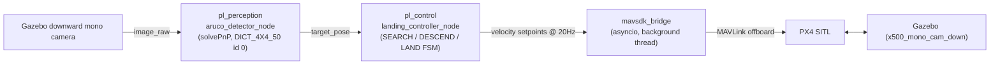
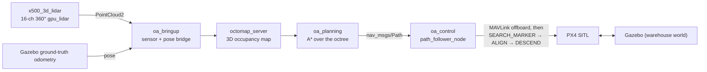
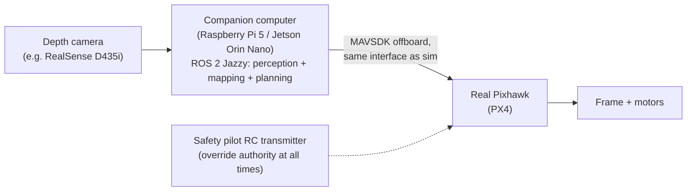

# AviationSim

A simulation-first autonomous-drone stack built on **PX4 SITL + Gazebo Harmonic +
ROS 2 Jazzy + MAVSDK**, developed as a series of milestones: classical
vision-based control (Milestones 1-2), then a research pivot comparing that
classical controller against a learned residual RL policy trained in NVIDIA
Isaac Lab (Milestone 3). Everything here runs in simulation; a possible
(not-yet-attempted) real-hardware follow-up is sketched at the bottom.

## Environment

- Ubuntu 24.04, ROS 2 Jazzy
- PX4-Autopilot v1.16.0, cloned as a sibling directory: `~/PX4-Autopilot`
  (kept outside this repo / gitignored — see [`sim_assets/`](#repo-layout) for
  why that matters)
- Gazebo Harmonic (`gz-sim8`)
- MAVSDK (Python, `mavsdk` pip package)
- OpenCV with `cv2.aruco` support (Milestone 1 & 2)
- NVIDIA Isaac Sim 5.1 + Isaac Lab (cloned to `~/IsaacLab`), in a `uv`-managed
  Python 3.11 venv at `~/lab` — a separate stack from ROS 2/PX4 above
  (Milestone 3 only)

## Repo layout

```
AviationSim/
├── precision_landing_ws/        ROS 2 workspace (src/ has the buildable packages)
│   └── src/
│       ├── pl_perception/       Milestone 1: ArUco marker detection
│       ├── pl_control/          Milestone 1: MAVSDK offboard bridge + landing FSM
│       ├── pl_bringup/          Milestone 1: launch files + params
│       ├── oa_bringup/          Milestone 2: LiDAR + pose bridging
│       ├── oa_planning/         Milestone 2: 3D occupancy grid + A* planner
│       ├── oa_control/          Milestone 2: MAVSDK trajectory follower +
│       │                         post-course ArUco landing FSM
│       └── oa_vio/              Unused appendix: OpenVINS VIO integration,
│                                 removed from the active pipeline (see
│                                 Milestone 2 below) but kept on disk
├── sim_assets/                  Gazebo worlds/models/airframes for Milestone 2,
│                                 version-controlled here and symlinked into the
│                                 PX4-Autopilot clone by scripts/link_gz_assets.sh
├── oa_rl/                       Milestone 3: Isaac Lab RL task for the
│                                 classical-vs-RL research pivot (kept outside
│                                 ~/IsaacLab, same "engine external, project
│                                 code in-repo" pattern as PX4-Autopilot/oa_vio)
├── scripts/
│   ├── launch_sim.sh            One-command PX4 + Gazebo + ROS 2 launch (Milestone 1)
│   ├── link_gz_assets.sh        Symlinks sim_assets/ into ~/PX4-Autopilot
│   ├── build_openvins.sh        Builds the (now-unused) OpenVINS VIO dependency
│   └── hover_test.py            Standalone MAVSDK hover smoke test
└── README.md
```

**Why `sim_assets/` exists:** PX4-Autopilot is gitignored from this repo, but
custom Gazebo worlds/models/airframe scripts have to physically live inside
the PX4 clone's directory tree to be usable. `sim_assets/` is the source of
truth (tracked here in git); `scripts/link_gz_assets.sh` symlinks each piece
into place and — for airframes — patches the one PX4 `CMakeLists.txt` line
that registers a new `gz_<model>` make target. Re-run it any time you re-clone
PX4-Autopilot.

## Milestone 1 — GPS-denied precision landing

**Goal:** land on a 0.5 m ArUco marker using only vision + baro altitude for
the final approach — without disabling GPS at the estimator level, so PX4's
offboard mode and failsafes behave normally. "GPS-denied" is enforced only at
the control-law level (the landing controller simply never looks at GPS).

**Pipeline:**


- `pl_perception/aruco_detector_node`: subscribes to the bridged Gazebo camera,
  detects the marker, publishes a body-frame `target_pose` via solvePnP.
- `pl_control/landing_controller_node` + `mavsdk_bridge`: a state machine
  (SEARCH → converge → DESCEND → LAND) that runs an expanding-square search
  pattern to hunt for the marker, then closes a horizontal PI loop on the
  marker offset while descending, then hands off to `Action.land()` below
  `final_land_alt_m`.
- `pl_bringup`: launch file + `control_params.yaml` / `marker.yaml`.

**Run:** `bash scripts/launch_sim.sh`

**Status:** takeoff/landing mechanics work end-to-end; marker acquisition
reliability is the active work item (the expanding-square search was the most
recent addition, to actively hunt for the marker instead of assuming it's
directly below).

## Milestone 2 — 3D obstacle avoidance & path planning

**Goal:** fly a 3D-LiDAR-equipped drone through an indoor "warehouse" full of
pillars without colliding, using a real-time occupancy map and an A* planner,
then hand off to a Milestone-1-style ArUco landing once the goal is reached.

**Pipeline:**


A custom `warehouse.sdf` world (three rows of pillars in a bounded room, each
row's gaps offset from the next so flying straight through one row's gap
always puts a pillar from the next row directly ahead — a proper slalom, not
a single detour) and an `x500_3d_lidar` vehicle model (a 16-channel,
360°, gpu_lidar sensor mounted on the standard PX4 x500 quad, plus a
downward mono camera) give the drone something real to navigate around and,
at the end, land on. `oa_bringup` bridges the LiDAR's point cloud and pose
into ROS 2; `octomap_server` folds that into a running 3D occupancy map;
`oa_planning` runs A* over the map to produce a collision-free path to the
goal; `oa_control`'s `path_follower_node` walks that path via the same
MAVSDK-offboard-over-a-background-asyncio-thread pattern Milestone 1's
`mavsdk_bridge` uses, then — once the goal is reached — extends into
`SEARCH_MARKER → ALIGN_MARKER → DESCEND_MARKER → LANDED` states reusing
Milestone 1's `aruco_detector_node` and PI controller directly.

**On GPS-denial:** an OpenVINS-based VIO pipeline (`oa_vio`) was built and
wired in as a GPS-denied localization source, matching Milestone 1's
philosophy, but ran into persistent divergence under this vehicle's motion
profile with no guaranteed fix timeline. It was fully removed from the active
pipeline (kept unused on disk as appendix/future-work material) in favor of
Gazebo's ground-truth pose — a deliberate scope decision tied to the Milestone
3 pivot below, where training/evaluating an RL policy needs privileged state
anyway, so GPS-denial stopped being the load-bearing goal here.

**Status:** verified end-to-end — takeoff, a full collision-free flight
through all three pillar rows to the goal, then finds and lands on the ArUco
marker placed there.

**Run:**
```bash
bash scripts/link_gz_assets.sh
cd ~/PX4-Autopilot
PX4_GZ_WORLD=warehouse PX4_GZ_MODEL_POSE="-8.5,0,0.2,0,0,0" make px4_sitl gz_x500_3d_lidar
```
Then, with the sim running: `gz topic -l | grep scan` / `gz topic -e -t /scan/points`
to see the live point cloud (the LiDAR sensor uses lazy publishing, so the
topic only appears once something subscribes to it).

## Milestone 3 — Research pivot: hybrid imitation + residual RL (Isaac Lab)

**Goal:** reframe the project from a pure classical-control demo into a
quantitative research comparison: a learned residual RL policy outputs a
corrective vector on top of the classical A* + trajectory-follower's proposed
action, evaluated against the classical controller alone on four metrics —
success rate, trajectory efficiency, compute overhead, and robustness (via
domain randomization). Landing precision was dropped from the metric set:
the RL task operates on the 2D navigation plane only (see `oa_rl` below), so
landing isn't part of what this comparison measures. Planned staging is IL
pretraining (near-zero-residual warm start) followed by RL fine-tuning,
rather than RL from scratch.

**Why not train through PX4 SITL + Gazebo:** real-time-locked lockstep
simulation plus software-rendered Gazebo made single episodes take 60-190s;
RL realistically needs thousands to tens of thousands of episodes. Training
instead runs in NVIDIA Isaac Lab (GPU-parallelized physics), with the trained
policy later validated back in the full Gazebo/PX4 stack — a sim-to-sim
transfer check that doubles as a robustness data point.

**`oa_rl`:** an Isaac Lab "external project" (own `source/oa_rl` pip package,
registered as gym env `Isaac-WarehouseAvoidance-Direct-v0`) reproducing
`warehouse.sdf`'s room/pillar layout with a velocity-commanded drone. Actions
are 2D (`vx`, `vy`) rather than 3D, with altitude held by a small internal
proportional controller instead of being learned. This wasn't a compute or
efficiency call — it was forced by the environment: this warehouse's pillars
are floor-to-ceiling (4.0m, taller than the 3.5m walls), so there's no
altitude at which the maze can be flown over, and z-axis motion gives the
policy zero obstacle-avoidance benefit. The first training run used 3D
actions and confirmed this empirically rather than just in theory: the
policy learned nothing useful (action std stuck near its initial value,
100% of episodes ending in `out_of_bounds`) because the free but useless
z-axis gave it an easy way to leave the play area without ever engaging with
the actual 2D navigation problem. Constraining to `action_space=2` removed
that failure mode. This also reframes what "goal reached" means for this
RL task: successful 2D navigation to the goal region, not landing — physical
descent/landing remains the classical FSM's job (Milestones 1-2) and is
deliberately out of scope for the RL policy, which is also why landing
precision was dropped from this milestone's metrics (see below). This first
version proves the training loop runs end to end with a plain reward; IL
pretraining, the residual-on-classical-controller architecture, and domain
randomization are
deliberately not part of it yet.

**Run:**
```bash
cd oa_rl
source ~/lab/bin/activate
python -m pip install -e source/oa_rl   # first time only

# Sanity check: package registration, scene spawn, reset/step cycle
timeout 120 python scripts/random_agent.py \
  --task Isaac-WarehouseAvoidance-Direct-v0 --num_envs 4 --headless

# Train
python scripts/rsl_rl/train.py \
  --task Isaac-WarehouseAvoidance-Direct-v0 --headless --num_envs 64
```

**Status:** a real-scale run from scratch (`num_envs=8192`,
`max_iterations=5000`) solved obstacle avoidance outright (0% collision, 0%
out-of-bounds) but exposed a reward-hacking bug: `goal_reached` never fired
because per-step proximity reward, paid for the whole episode, was more
profitable than the one-time goal bonus that ends it — so the policy learned
to loiter just outside the goal radius instead of finishing. Fixed with
potential-based reward shaping (Ng, Harada & Russell 1999): reward is now
paid on *progress* toward the goal (a telescoping potential-difference term)
rather than raw proximity, so loitering nets zero once progress stalls. A
repeat of the same real-scale run confirms the fix: `goal_reached` jumped
from 0% to 98.4%, `final_distance_to_goal` moved from 0.3015 (just outside
the 0.3 goal radius) to 0.2495, and collision/out-of-bounds stayed at 0% —
obstacle avoidance was preserved, not traded away for goal-reaching.

This validates the environment and training pipeline, but is still a
standalone policy trained from scratch, not the residual-on-classical
comparison the milestone is about. Not yet attempted: the residual
architecture (a classical-controller baseline isn't in this loop at all
yet), IL pretraining, domain randomization, a classical baseline run through
the same harness for an apples-to-apples comparison, and sim-to-sim
validation back in Gazebo/PX4.

## Optional: real-hardware test (not attempted, not committed to)

Everything above is simulation only. Moving any of it onto real hardware is a
substantial, separate effort with real safety/legal/cost stakes that
simulation doesn't have, and **this section is a draft sketch for later
discussion, not a plan that's been validated or started.**

**Proposed scope:** a small, low-risk bench/tethered test of *one slice* of
the Milestone 2 pipeline — not a full untethered obstacle-avoidance flight on
the first attempt.

**Draft architecture:**



- **Airframe:** an existing small quad frame (5"–7" class), not a new build.
- **Companion computer:** Raspberry Pi 5 or Jetson Orin Nano running the same
  ROS 2 Jazzy stack, so `oa_planning`/`oa_control` code doesn't need to change
  between sim and hardware — only the sensor driver and the MAVLink endpoint
  (SITL → real Pixhawk) change.
- **Flight controller:** a real Pixhawk running PX4, talked to via the same
  MAVSDK offboard interface already used in sim.
- **Sensor swap:** the sim uses a full 3D LiDAR; a real spinning LiDAR
  (Livox/RPLiDAR) is a bigger, pricier, heavier first step. A depth camera
  (Intel RealSense D435i) is the more realistic first hardware sensor —
  which means the occupancy-mapping node would need to consume depth-camera
  point clouds instead of the 360° LiDAR sweep, a real (if contained) change
  from what Milestone 2 builds in sim.
- **Suggested validation ladder** (each step must pass before the next):
  1. **Bench test, props off:** run perception + mapping + planning against
     the real depth camera, verify the occupancy map and planned path look
     sane in RViz.
  2. **Tethered hover:** verify MAVSDK offboard setpoints are accepted and
     sane on the real Pixhawk, still tethered, no obstacles yet.
  3. **Supervised low-altitude indoor hover with obstacles:** only after 1
     and 2 both pass cleanly, and only with the safety pilot ready to take
     over instantly.

Timeline, exact hardware choices, and even whether to pursue this at all are
still open — treat this section as a starting point for a conversation, not
a committed roadmap.
